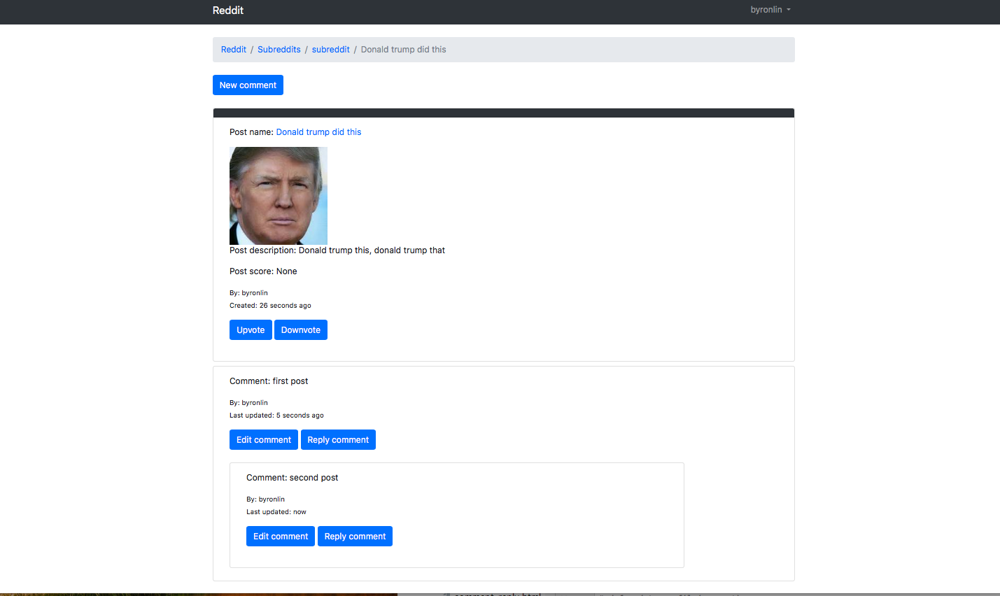

# Reddit clone

https://redditclone92.herokuapp.com/

# Set up
1. create virtual env within repo: `virtualenv venv -p python3`
2. activate virtual env: `source venv/bin/activate`
3. `python manage.py makemigrations`
4. `python manage.py migrate`
5. `python manage.py runserver` and use pip to install any missing packages (eg. Django)

Functionalities implemented:
1. Create subreddits (from admin)
2. User management (create, login)
3. Create post (ability to add title, description, URL, image upload)
4. Create/update/delete comments
5. Nested comments
6. Score (upvote/downvote) -partially working

Learnings
- MVC(Model view controller) architecture
  - Model: Model represents the shape of the data. A class in C# is used to describe a model. Model objects store data retrieved from the database.
  - View: Controls the user request, and handles logic to direct to the correct template.
  - Template: contains the UI (html pages).
- User goes to URL -> redirected to view (logic) -> gets the correct HTML page and displays to user
Challenges:
- Setting up the UI so it can link to other pages
  -Modelling the data so every page can be accessible 
- Nested comments
  -Used recursion, made a separate template for comments, so it can be recursively called so it looks nested
